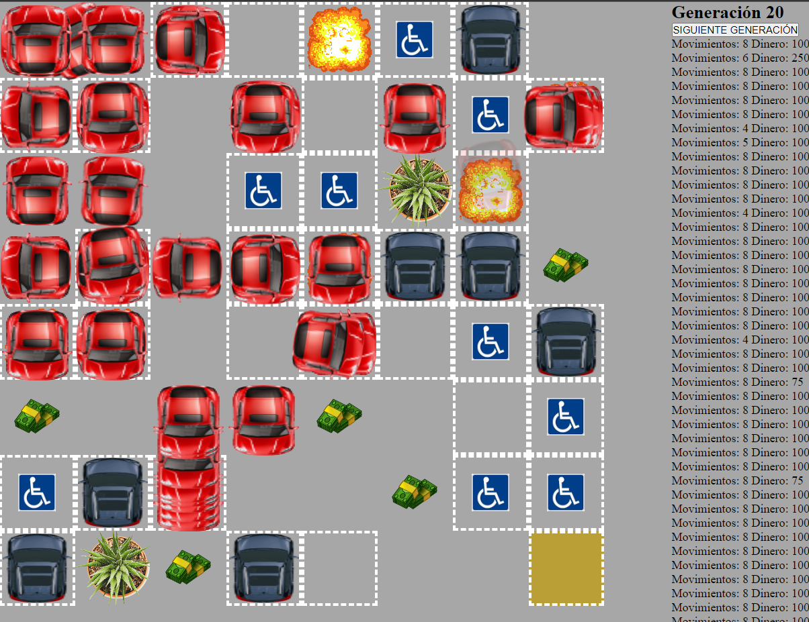

<!-- TODO TU CODIGO -->

# Juego de Aparcamiento

Un juego en el que aparecen muchos coches en un parking, los coches aparecen todos arriba a la izquiera del todo y tienen que aparcar abajo a la derecha, el parking es un tablero de 8x8, cada casilla tiene un significado distinto:

 Estos son los coches que se crean solos, cada uno con un cerebro distinto, se usa el algoritmo generacional, que mandandole como input lo que esta arriba, abajo, a la derecha y a la izquierda suyo, es capaz de tomar una decisión para saber donde tiene que ir. Funciona el juego por generaciones, en la primera generacion se crean 500 coches con cerebros aleatorios, y segun van pasando las generaciones mejoran estos, selecionando los mejores, y de esos haciendo copias con cruzes y mutaciones de sus cerebros. La IA que utilizo es con puro js, sin librerias, con 3 clases principalmente, clase Neurona, clase Capa y clase Red Neuronal.

 Representa un coche aparcado, si el coche se mueve a donde haya uno explota y el coche muere.

 El coche obtiene +50 de dinero si pasa por aquí.

 Si el coche pasa por una casilla que sea esto, le quita 25 de dinero por posicionarse en este sitio.

 Una planta que molesta el paso y impide a un coche ir a esta casilla aunque quisiera.

